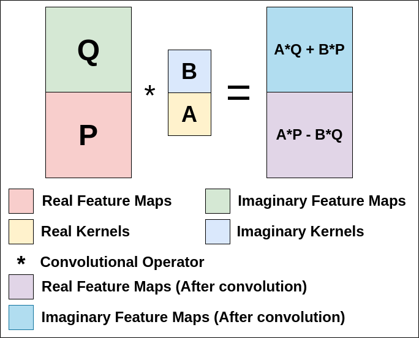

<!-- <div align=center> -->
<!--    <h1> -->
<!--    Grid-less-DOA -->
<!--    </h1> -->
<!-- </div> -->

<div align=center>
   <h2>
   Sequential DOA Trajectory Estimation using Deep Complex Network and Residual Signals
   </h2>
</div>

## Abstract:
> We propose a data-driven method for direction-of-arrival (DOA) trajectory estimation. We use a deep complex architecture which leverages complex-valued representations to capture both magnitude and phase information in the received sensor array data. The network is designed to output the DOA trajectory parameters and amplitudes of the strongest source. Deviating from conventional methods, which attempt to estimate parameters for all sources simultaneously -- leading to assignment ambiguity and the problem of uncertain output dimensions, we adopt a sequential approach. The estimated source signal contribution is subtracted from the input to obtain a residual signal. This residual signal is then fed back into the network to identify the next strongest source and so on, making the proposed network reusable. We evaluate our network on simulated data of varying complexity. Results demonstrate the feasibility of such a reusable network and potential improvements can be explored in future.

<div align=center>
   
   <figcaption>
	  Sequential DOA trajectory estimation: TL-CBF spectrum of original signal (a), and of residual signals (b)-(d) obtained after removal of every additional source. True sources are indicated by red cross. The estimated source trajectories are indicated by red circle in panels (a)-(c), which are partially or fully removed in subsequent spectra (b)-(d). The average power per sensor per snapshot (P) is indicated.
    </figcaption>
</div>


## Signal Model:
<blockquote>
 
Consider a uniform linear array (ULA) with $N$ sensors. Assuming linear source motion, the DOA $\theta^l_k$ for $k{\text{-th}}$ source at $l{\text{-th}}$ snapshot is,

$$\theta^l_k = \phi_k + \frac{l-1}{L-1}\alpha_k, \quad l=1,2, \cdots, L.$$

The parameters $(\phi_k,\alpha_k)$ model the DOA trajectory of the $k{\text{-th}}$ source. For $K$ linearly moving sources,

$$\mathbf{Y} = \tilde{\mathbf{A}}\tilde{\mathbf{X}} + \mathbf{W}$$

where 
* $\mathbf{Y} = [\mathbf{y}_1 \cdots \mathbf{y}_L] \in \mathbb{C}^{N \times L}$ is the $L$-snapshot measurement matrix; 
* $\tilde{\mathbf{A}} = [\tilde{\mathbf{A}}_1(\phi_1, \alpha_1) \cdots \tilde{\mathbf{A}}_K(\phi_K, \alpha_K)] \in \mathbb{C}^{N \times KL}$ contains     the variable DOA steering vectors for each of the $K$ sources;
* $$\tilde{\mathbf{A}}_k(\phi_k, \alpha_k) = [ \mathbf{a}(\theta^1_k) \cdots \mathbf{a}(\theta^L_k)]$$ is the steering matrix for the $k{\text{-th}}$ source, where $\mathbf{a}(\theta_k^l) = [ 1 \quad e^{j2\pi \frac{d}{\lambda}\text{sin}(\theta_k^l)} \quad \cdots \quad e^{j2\pi(N-1)\frac{d}{\lambda}\text{sin}(\theta_k^l)} ]^T$ is the steering vector for DOA $\theta_k^l$;
* $d$ is sensor separation and $\lambda$ is observation wavelength;
* $\tilde{\mathbf{X}} = [\tilde{\mathbf{X}}_1 \cdots \tilde{\mathbf{X}}_K]^T \in \mathbb{C}^{KL \times L}$ with $\tilde{\mathbf{X}}_k = \text{diag}(\mathbf{x}_k) \in \mathbb{C}^{L \times L}$, where $\mathbf{x}_k = [s_k^1 \cdots s_k^L]$ are $L$ amplitudes of the $k{\text{-th}}$ source;
* $\mathbf{W}=[\mathbf{w}_1 \cdots \mathbf{w}_L] \in \mathbb{C}^{N \times L}$ represents the additive noise.

<div align="center">
    <table>
	<td><div align=center>
		 <figcaption> Linearly moving source.</figcaption></div></td> 
	<td><div align=center>
		 <figcaption> DOA as a function of snapshots.</figcaption></div></td> 
    </table>
</div>
</blockquote>

## Architecture:
<blockquote>
<div align=center>
		
		<figcaption>
			Deep complex network -- feature extractor (shaded pink), amplitude estimator (shaded blue), and trajectory estimator (shaded peach). Every block has complex weights except for the LSTM  and dense layers in the trajectory estimator. The architecture has 548,152 parameters.
		</figcaption>
</div>
<br>
<p>
The overall network architecture is shown above. It consists of three main parts: feature extractor (shaded pink), amplitude estimator (shaded blue), and trajectory estimator (shaded peach). The feature extractor processes the input $\mathbf{Y}$ \eqref{eq:sensor_array} and outputs complex features that serve as input to the two estimators. The amplitude estimator is designed to estimate the source amplitudes $\mathbf{X}$, while the trajectory estimator is designed to estimate the trajectory parameters $(\phi,\alpha)$, both for the same source (strongest). Each convolutional block performs a complex convolutional operation, followed by complex batch normalization (BN) and an activation function. 
</p>

<p>
<b>Complex-valued Convolutional Block:</b> Complex-valued convolution can be described as follows. Let $\mathbf{W}=\mathbf{A}+i\mathbf{B}$ be the complex-valued convolutional kernels characterized by real-valued matrices $\mathbf{A}$ and $\mathbf{B}$. The complex matrix $\mathbf{H}=\mathbf{P}+i\mathbf{Q}$ is the input feature to the convolution block. The complex-valued convolution is mathematically formulated as $\mathbf{W}*\mathbf{H}= (\mathbf{A}*\mathbf{P}-\mathbf{B}*\mathbf{Q}) + i(\mathbf{A}*\mathbf{Q} + \mathbf{B}*\mathbf{P})$ where $*$ denotes the convolution operation. Check the figure below, which provides a visual representation of the complex convolution operation. For implementation, see <a href="Gridless/net_modules.py#L6"> modules</a>.
</p>

<div align="center">
	
<!-- 	<figcaption>Complex convolution operation.</figcaption> -->
</div>

<p>
<b> Network Flow and Description :</b> <br>  
    <ul style="display: inline; padding-left: 0; list-style-type: none;">
        <li style="display: inline; margin-right: 10px;"><a href="Gridless/model.py#L7">Feature Extractor</a>: It comprises of convolutional blocks, followed by alternate double inception blocks and convolutional downsampling block. To capture and process information at multiple scales (receptive fields sizes), <a href="Gridless/net_modules.py#L53">inception blocks</a> are used. It is constructed with five distinct convolutional blocks, each characterized by a different kernel size: (1, 1), (1, 3), (3, 1), (3, 3), and (5, 1). The number of output channels for different inception blocks are given in <a href="Gridless/config.yml"> config file</a>. The stride is 1 and padding is adjusted based on the kernel size to ensure that the input size remains identical to the output size. We down-sample the input using a <a href="Gridless/net_modules.py#L176"> dilated convolutional block</a> to extract essential information. The kernel size, dilation rate, stride, and padding for this operation are (3, 1), (2, 1), (1, 1) and, (1, 0) respectively. <a href="Gridless/net_modules.py#L129">ResNet blocks</a> are used to process and downsample the features from the inception blocks prior to the skip connections in the amplitude estimator. </li>
        <li style="display: inline; margin-right: 10px;"> <a href="Gridless/model.py#L53">Amplitude Estimator</a>: The output of feature extractor is passed through two inception blocks configured with the same hyperparameters as described above. This output is then concatenated (via a first skip connection) with the features which are processed by ResNet blocks. It then undergoes a down-sampling process before concatenating via a second skip connection with an alternative set of features processed through another ResNet block. The combined output then undergoes further processing using complex convolutional blocks with a kernel size of (2, 1), a stride of 1, and zero padding. This output is processed through <a href="Gridless/model.py#L187">Squeeze-and-Excitation (SE) block</a>, followed by final complex convolution having kernel size 1. The SE block encompasses two primary operations: squeezing and excitation. Squeezing aggregates feature maps across their spatial dimensions to generate a channel descriptor. Excitation takes this channel descriptor as input and generates a set of per-channel modulation weights. These weights are then applied to the feature maps to produce the SE block's output.</li>
        <li style="display: inline; margin-right: 10px;"> <a href="Gridless/model.py#L117">Trajectory Estimator</a>: Here, the output of the feature extractor is passed through two inception blocks, without using skip connections. This output is then down-sampled twice. To facilitate sequential processing across L snapshots, <a href="Gridless/net_modules.py#L205">LSTM</a> are used. The LSTM block is set with a hidden size of 64. This information is then passed through a fully connected dense layer followed by the Tanh non-linear activation function.</li>
    </ul>
</p>
</blockquote>

## Code:

### For Generating Training and Test data. <br>
> To generate ground truth DOA parameters
```
$ cd dataset_folder
$ python utils.py
```
> To generate Recevied signal, Ground truth signal amplitude and Tl-CBF spectrum.
```
$ cd dataset_folder
$ python main_datagen.py
```
> To generate test data.
```
$ cd dataset_folder
$ python generate_testdata.py
```

### For training the proposed network. <br>
> Change the dataset_path, label_path, and sigdata_path according to your directory.
```
$ cd Gridless
$ sbatch batch.sh
```
> To get test results,
```
$ python testdata_loss_acc.py
```

### For training the Gridbased network. <br>
```
$ cd Gridbased
```
> Change the dataset_path, label_path in main.py file. <br>
> For checkpointpath=f'./saved_models/exp18/gaussian_rmse/l2' in main.py, make sure reg_parameter=None, weight_decay=0. <br>
> For checkpointpath=f'./saved_models/exp18/gaussian_rmse/l2_l12' in main.py, make sure reg_parameter=5e-4, weight_decay=0. <br>
```
$ sbatch batch.sh
```
> To get test results,
```
$ python loss_acc.py
```

### For plots.
```
$ cd Gridless
$ python plots_results.py
```


