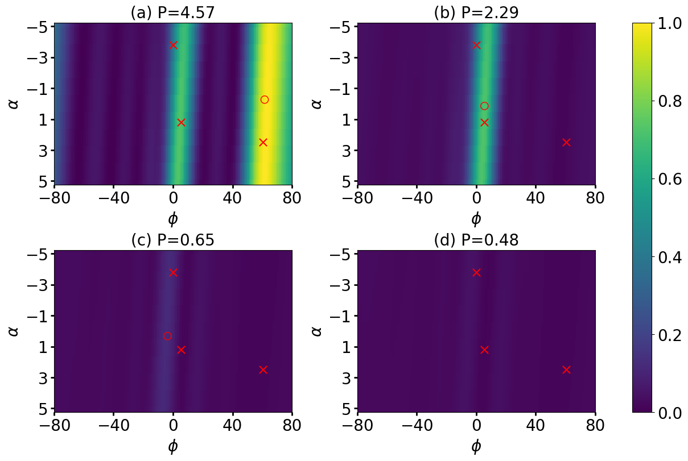
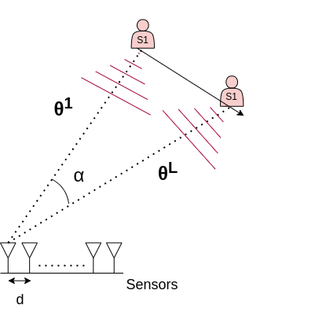
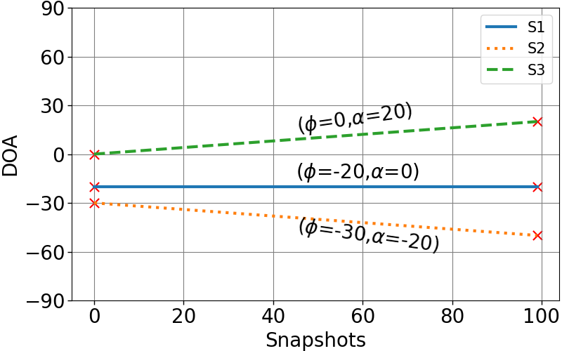
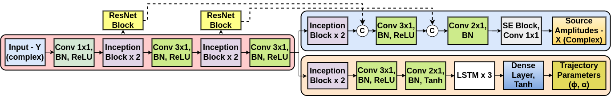

   <h1>
   Grid-less-DOA
   </h1>

   <h2>
   Sequential DOA Trajectory Estimation using Deep Complex Network and Residual Signals
   </h2>

   
   <figcaption>
	  Sequential DOA trajectory estimation: TL-CBF spectrum of original signal (a), and of residual signals (b)-(d) obtained after removal of every additional source. True sources are indicated by red cross. The estimated source trajectories are indicated by red circle in panels (a)-(c), which are partially or fully removed in subsequent spectra (b)-(d). The average power per sensor per snapshot (P) is indicated.
    </figcaption>

## Abstract:
> We propose a data-driven method for direction-of-arrival (DOA) trajectory estimation. We use a deep complex architecture which leverages complex-valued representations to capture both magnitude and phase information in the received sensor array data. The network is designed to output the DOA trajectory parameters and amplitudes of the strongest source. Deviating from conventional methods, which attempt to estimate parameters for all sources simultaneously -- leading to assignment ambiguity and the problem of uncertain output dimensions, we adopt a sequential approach. The estimated source signal contribution is subtracted from the input to obtain a residual signal. This residual signal is then fed back into the network to identify the next strongest source and so on, making the proposed network reusable. We evaluate our network on simulated data of varying complexity. Results demonstrate the feasibility of such a reusable network and potential improvements can be explored in future.

## Signal Model:
<blockquote>
 
Consider a uniform linear array (ULA) with $N$ sensors. Assuming linear source motion, the DOA $\theta^l_k$ for $k{\text{-th}}$ source at $l{\text{-th}}$ snapshot is,

$$\theta^l_k = \phi_k + \frac{l-1}{L-1}\alpha_k, \quad l=1,2, \cdots, L.$$

The parameters $(\phi_k,\alpha_k)$ model the DOA trajectory of the $k{\text{-th}}$ source. For $K$ linearly moving sources,

$$\mathbf{Y} = \tilde{\mathbf{A}}\tilde{\mathbf{X}} + \mathbf{W}$$

where 
* $\mathbf{Y} = [\mathbf{y}_1 \cdots \mathbf{y}_L] \in \mathbb{C}^{N \times L}$ is the $L$-snapshot measurement matrix; 
* $\tilde{\mathbf{A}} = [\tilde{\mathbf{A}}_1(\phi_1, \alpha_1) \cdots \tilde{\mathbf{A}}_K(\phi_K, \alpha_K)] \in \mathbb{C}^{N \times KL}$ contains     the variable DOA steering vectors for each of the $K$ sources;
* $$\tilde{\mathbf{A}}_k(\phi_k, \alpha_k) = [ \mathbf{a}(\theta^1_k) \cdots \mathbf{a}(\theta^L_k)]$$ is the steering matrix for the $k{\text{-th}}$ source, where $\mathbf{a}(\theta_k^l) = [ 1 \quad e^{j2\pi \frac{d}{\lambda}\text{sin}(\theta_k^l)} \quad \cdots \quad e^{j2\pi(N-1)\frac{d}{\lambda}\text{sin}(\theta_k^l)} ]^T$ is the steering vector for DOA $\theta_k^l$;
* $d$ is sensor separation and $\lambda$ is observation wavelength;
* $\tilde{\mathbf{X}} = [\tilde{\mathbf{X}}_1 \cdots \tilde{\mathbf{X}}_K]^T \in \mathbb{C}^{KL \times L}$ with $\tilde{\mathbf{X}}_k = \text{diag}(\mathbf{x}_k) \in \mathbb{C}^{L \times L}$, where $\mathbf{x}_k = [s_k^1 \cdots s_k^L]$ are $L$ amplitudes of the $k{\text{-th}}$ source;
* $\mathbf{W}=[\mathbf{w}_1 \cdots \mathbf{w}_L] \in \mathbb{C}^{N \times L}$ represents the additive noise.

    <table>
	<td>

		 <figcaption> Linearly moving source.</figcaption>
</td> 
	<td>

		 <figcaption> DOA as a function of snapshots.</figcaption>
</td> 
    </table>

</blockquote>

## Architecture:

	<blockquote>
		
		<figcaption>
			Deep complex network -- feature extractor (shaded pink), amplitude estimator (shaded blue), and trajectory estimator (shaded peach). Every block has complex weights except for the LSTM  and dense layers in the trajectory estimator. The kernel sizes used by the convolutional operations are specified. The Inception block uses kernels of size: $(1, 1)$, $(1, 3)$, $(3, 1)$, $(3, 3)$, and $(5, 1)$ while the ResNet uses $(3, 1)$. The architecture has $548,152$ parameters.
		</figcaption>
	</blockquote>

